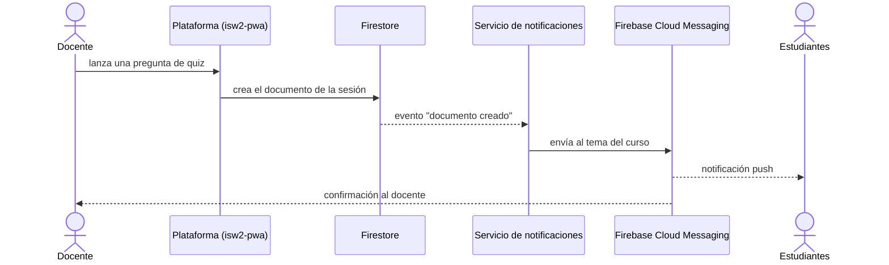

# Ingeniería de Software II · Servicio de notificaciones

> Funciones en la nube que envían las notificaciones push de la plataforma de aula de **Ingeniería de Software II (2016702)**
> Universidad Nacional de Colombia · Departamento de Ingeniería de Sistemas e Industrial · 2026-II

**Plataforma:** https://ingesoftun4l.com · **Código de la plataforma:** [OldHus/isw2-pwa](https://github.com/OldHus/isw2-pwa)

## ¿Qué hace?

Cuando el docente publica en el muro, lanza una encuesta o lanza una pregunta de quiz, a los estudiantes les llega una notificación al celular o al navegador. Este repositorio es el servicio que las envía.

Lo interesante es **cómo** se entera: la plataforma nunca llama a este servicio. Solo guarda el dato en la base de datos, y el servicio reacciona a ese cambio.



## Funciones

Todo el servicio está en un solo archivo: [`functions/src/index.ts`](functions/src/index.ts).

### Reaccionan a eventos de la base de datos

| Función | Se dispara cuando se crea un documento en | Qué notifica |
|---|---|---|
| `onPostCreated` | `cursos/{courseId}/posts/{postId}` | Nueva publicación en el muro, con los primeros 60 caracteres del texto. |
| `onPollStarted` | `cursos/{courseId}/encuestas/{encuestaId}` | Encuesta abierta, con la pregunta. |
| `onQuizLaunched` | `cursos/{courseId}/sesionQuiz/{sesionId}` | Pregunta de quiz en vivo, con el enunciado. |

Cada una envía dos mensajes: el aviso a los estudiantes y una confirmación al docente. El título del aviso se elige al azar de una lista, por eso a veces llega "🚀 Deploy a producción" y otras "🐛 Debuggea esto rápido".

### Las invoca la plataforma

| Función | Qué hace |
|---|---|
| `subscribeToNotifications` | Recibe el identificador del dispositivo y lo suscribe al tema que le corresponde. |
| `unsubscribeFromNotifications` | Lo retira de ese tema. |

En la plataforma, estas llamadas salen de los casos de uso `SubscribeToCourseNotificationsUseCase` y `UnsubscribeFromCourseNotificationsUseCase`.

## Temas: a quién le llega qué

Las notificaciones no se envían persona por persona. Cada dispositivo se suscribe a un **tema** y el servicio publica en el tema:

| Tema | Quién está suscrito |
|---|---|
| `curso_{courseId}_estudiantes` | Los estudiantes del curso |
| `curso_{courseId}_docente` | El docente del curso |

Quien publica no necesita saber cuántos dispositivos hay ni cuáles son.

## Conceptos del curso que puedes ver aquí

| Concepto | Dónde verlo |
|---|---|
| **Arquitectura dirigida por eventos** | Las tres funciones `onDocumentCreated`: nadie las llama, reaccionan a un hecho que ya ocurrió. |
| **Bajo acoplamiento** | La plataforma no conoce este servicio. Se puede apagar, cambiar o reescribir sin tocar una línea de `isw2-pwa`. |
| **Publicador/suscriptor** | Los temas de mensajería: el patrón Observer llevado a un sistema distribuido. |
| **Nunca confíes en el cliente** | `subscribeToNotifications` exige sesión iniciada y averigua el curso y el rol consultando la base de datos desde el servidor. El cliente no puede decir "soy docente". |
| **Validación de entradas** | `requireToken` rechaza la petición si el dato no llega o no es del tipo esperado. |
| **Errores con significado** | `HttpsError` con códigos como `unauthenticated`, `invalid-argument` y `failed-precondition`, en lugar de un error genérico. |
| **Funciones pequeñas** | `studentTopic`, `teacherTopic`, `topicForRole`, `pickRandom`: cada una hace una sola cosa y tiene un nombre que la explica. |
| **Control de costos** | `setGlobalOptions({ maxInstances: 10 })` limita cuántas copias pueden correr a la vez. |

## Tecnologías

- **TypeScript** sobre **Node.js 24**
- **Cloud Functions for Firebase** (2.ª generación)
- **Cloud Firestore** como fuente de eventos
- **Firebase Cloud Messaging** para la entrega de notificaciones
- **Firebase Admin SDK**

## Estructura

```text
.
├── firebase.json          configuración del despliegue
├── .firebaserc            proyecto de Firebase asociado
└── functions/
    ├── src/
    │   └── index.ts       todas las funciones
    ├── package.json
    └── tsconfig.json
```

## Ejecutarlo en local

Requisitos: Node.js 24 y la CLI de Firebase (`npm install -g firebase-tools`).

```bash
git clone https://github.com/OldHus/isw2-notification-service.git
cd isw2-notification-service/functions
npm install
npm run build
```

| Comando (dentro de `functions/`) | Qué hace |
|---|---|
| `npm run build` | Compila TypeScript a `lib/` |
| `npm run build:watch` | Compila cada vez que guardas |
| `npm run serve` | Compila y levanta el emulador de funciones |
| `npm run shell` | Consola interactiva para invocar funciones |
| `npm run deploy` | Despliega las funciones en Firebase |
| `npm run logs` | Muestra los registros de las funciones desplegadas |

El despliegue apunta al proyecto de Firebase del curso y requiere permisos sobre él. Para experimentar, crea tu propio proyecto y selecciónalo con `firebase use <tu-proyecto>`.

## Preguntas para explorar

- Si el envío de una notificación falla a mitad de camino, ¿se pierde, se reintenta o podría llegar duplicada? ¿Cómo harías la función idempotente?
- ¿Por qué el rol se consulta en el servidor en lugar de recibirlo como parámetro desde la aplicación? ¿Qué podría hacer un usuario malintencionado si fuera al revés?
- Enviar a un tema o enviar a cada dispositivo por separado: ¿qué se gana y qué se pierde con cada opción?
- Los textos de las notificaciones están escritos en el código. ¿Dónde los pondrías para poder cambiarlos sin volver a desplegar?
- Las tres funciones de eventos se parecen mucho entre sí. ¿Vale la pena unificarlas? ¿Qué principio de diseño estaría en juego?
